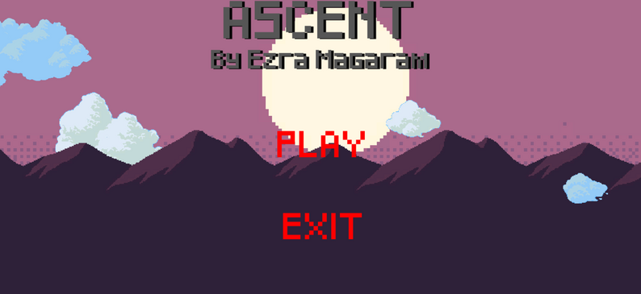
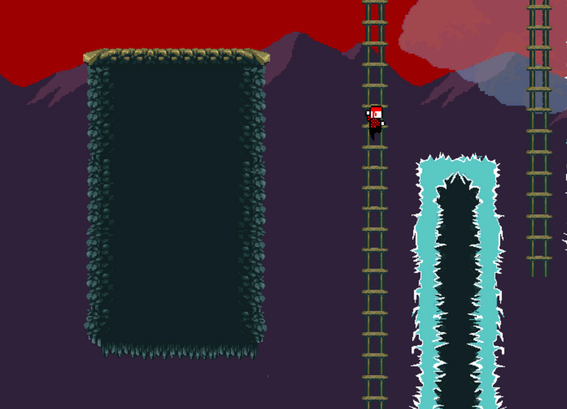
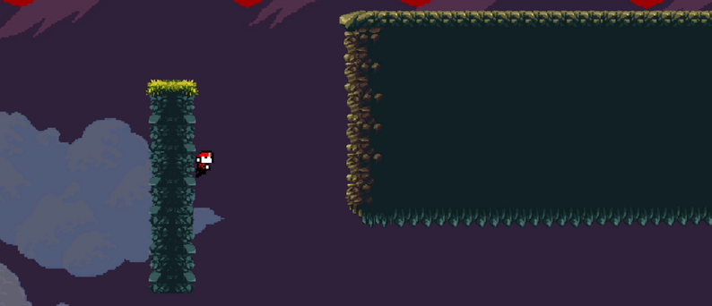
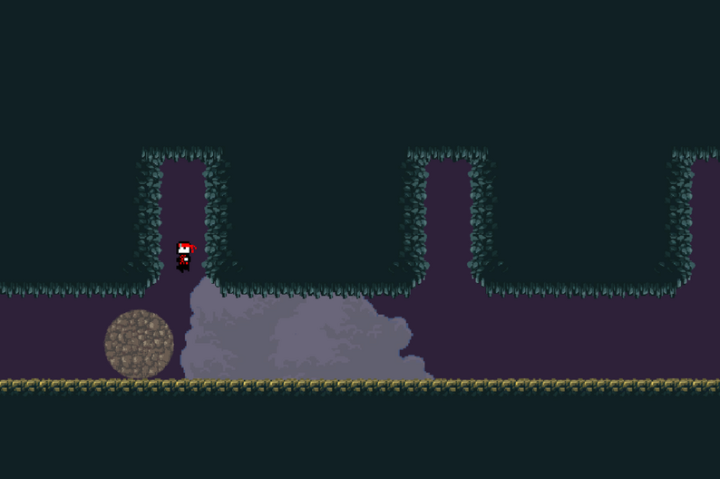

# Ascent

Wanting to make video games is what first got me interested in computer programming, and Ascent was my first large coding project. Ascent is a 2D pixel-art platformer built in Unity with C#. The game features hand-crafted pixel art, platforming mechanics (ladders, wall jumping, ice sliding), checkpoints, a menu system, and a mysterious cinematic scene at the end of the game.

## Screenshots

